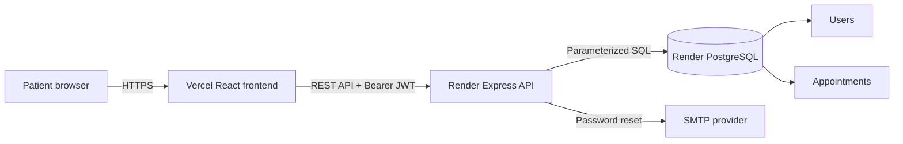

# MyChart Patient Portal

A responsive full-stack patient portal with JWT authentication, persistent PostgreSQL data, appointment management, bilingual content, dark mode, billing, medications, test results, secure messages, and a portal chatbot.

## Screenshots

### Homepage


### Login and portal assistant


### Medications


## Features

- User registration and login with signed JWT access tokens
- Password hashing with bcrypt
- Password reset email flow with expiring tokens
- PostgreSQL-backed user and appointment data
- Create appointments with provider, type, date, time, reason, and notes
- View upcoming, past, and cancelled appointments
- Update and reschedule appointments
- Cancel appointments with persistent status changes
- User-level data isolation on every appointment query
- Dashboard, test results, billing, medications, and secure messages
- English and Spanish UI controls
- Light and dark themes
- Responsive MyChart assistant with portal shortcuts
- Vercel frontend and Render backend deployment configuration

## Tech Stack

| Layer | Technology |
| --- | --- |
| Frontend | React 18, TypeScript, Vite, Tailwind CSS |
| UI | Radix UI primitives, Lucide icons |
| Backend | Node.js, Express |
| Database | PostgreSQL with `pg` connection pooling |
| Authentication | JWT, bcryptjs |
| Email | Nodemailer / SMTP |
| Frontend deployment | Vercel |
| Backend deployment | Render Web Service |
| Database deployment | Render PostgreSQL |

## Architecture



The React frontend stores the JWT and basic user profile in browser storage. All appointment operations call the Express API with `Authorization: Bearer <token>`. The API verifies ownership and uses parameterized PostgreSQL queries, so users can only access their own appointments.

## API

### Authentication

| Method | Endpoint | Description |
| --- | --- | --- |
| POST | `/api/auth/register` | Create a user and return a JWT |
| POST | `/api/auth/login` | Authenticate and return a JWT |
| GET | `/api/auth/verify` | Verify JWT and return the current user |
| PATCH | `/api/auth/profile` | Update the authenticated user's profile |
| PATCH | `/api/auth/password` | Change password after checking the current password |
| POST | `/api/auth/forgot-password` | Send a password reset link |
| POST | `/api/auth/reset-password` | Reset password with an expiring token |

### Appointments

All appointment routes require a Bearer JWT.

| Method | Endpoint | Description |
| --- | --- | --- |
| GET | `/api/appointments` | List the current user's appointments |
| GET | `/api/appointments/:id` | Get one owned appointment |
| POST | `/api/appointments` | Create an appointment |
| PATCH | `/api/appointments/:id` | Update or reschedule an appointment |
| DELETE | `/api/appointments/:id` | Cancel an appointment |

## Local Development

### Prerequisites

- Node.js 20+
- PostgreSQL 14+

### Setup

1. Create a PostgreSQL database:

```bash
createdb mychart
```

2. Install dependencies and create the environment file:

```bash
npm install
cp .env.example .env
```

3. Update `DATABASE_URL` and `JWT_SECRET` in `.env`.

4. Start frontend and backend together:

```bash
npm run dev:all
```

The backend creates the `users` and `appointments` tables and index automatically on startup.

- Frontend: `http://127.0.0.1:5173`
- API: `http://localhost:5000`
- Health check: `http://localhost:5000/api/health`

## Environment Variables

| Variable | Used by | Purpose |
| --- | --- | --- |
| `DATABASE_URL` | Backend | PostgreSQL connection string |
| `JWT_SECRET` | Backend | JWT signing secret |
| `CLIENT_URL` | Backend | Frontend URL for reset links |
| `CLIENT_URLS` | Backend | Comma-separated CORS origins |
| `VITE_API_URL` | Frontend | Deployed Render API origin |
| `SMTP_*` | Backend | Optional password reset email delivery |

## Deploy Backend and PostgreSQL to Render

1. Push the repository to GitHub.
2. In Render, choose **New > Blueprint** and select the repository.
3. Render reads `render.yaml` and creates the web service and PostgreSQL database.
4. Set `CLIENT_URL` and `CLIENT_URLS` to the final Vercel URL.
5. Optionally configure the SMTP variables.
6. Confirm `https://<render-service>/api/health` returns `database: connected`.

See the [Render Blueprint specification](https://render.com/docs/blueprint-spec) for the infrastructure fields used by `render.yaml`.

## Deploy Frontend to Vercel

1. Import the same GitHub repository into Vercel.
2. Keep the detected Vite build settings.
3. Add `VITE_API_URL=https://<render-service>` in Vercel environment variables.
4. Deploy, then add the resulting Vercel URL to Render's `CLIENT_URLS`.

The included `vercel.json` preserves React Router routes when pages are refreshed directly.
See Vercel's [Vite SPA deployment guide](https://vercel.com/docs/frameworks/frontend/vite#using-vite-to-make-spas) for the rewrite pattern.

## Testing

```bash
npm test
```

This runs TypeScript checking and a production Vite build. To validate the API locally, start PostgreSQL and run `npm run server`, then check `/api/health`.

## Security Notes

- Use a long random `JWT_SECRET` in every deployed environment.
- Never commit `.env` files or database credentials.
- PostgreSQL calls use parameterized queries.
- Passwords are hashed with bcrypt and never returned by the API.
- Appointment queries always include the authenticated user ID.
