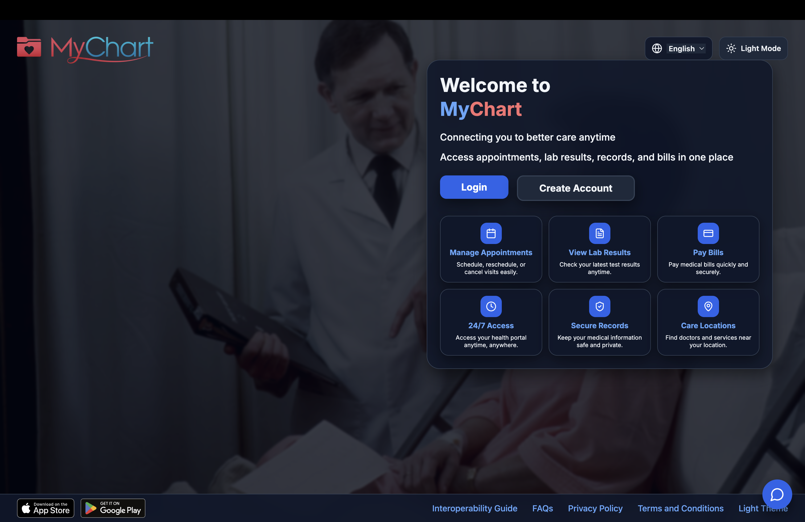
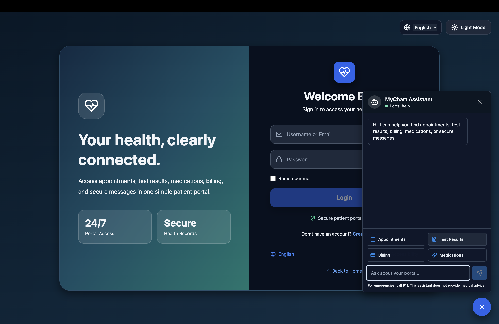
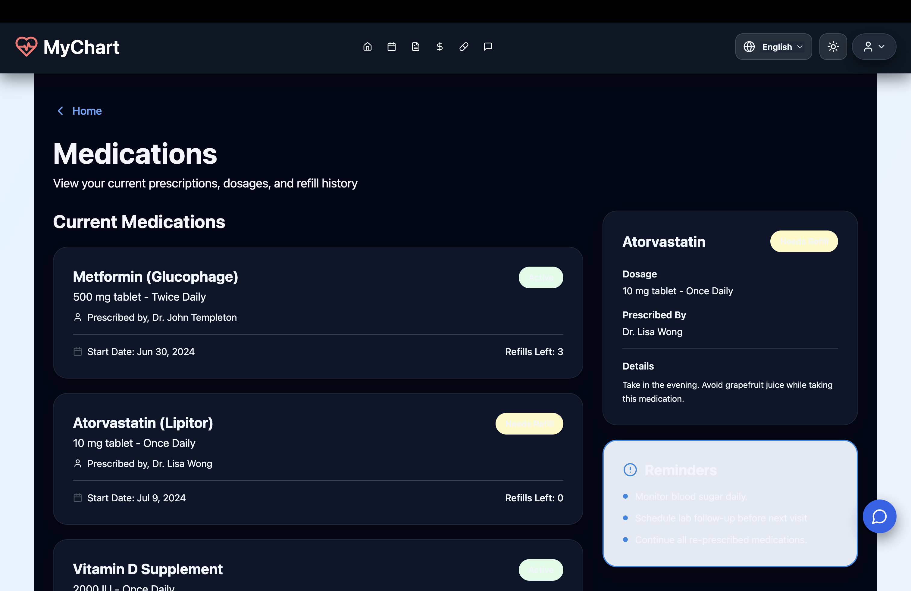
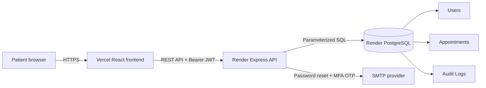

# MyChart Patient Portal

A responsive full-stack patient portal with JWT authentication, persistent PostgreSQL data, appointment management, bilingual content, dark mode, billing, medications, test results, secure messages, and a portal chatbot.

## Screenshots

### Homepage



### Login and portal assistant



### Medications



## Features

- Email-first registration and login with signed, one-hour JWT access tokens
- Role-based users with `patient`, `doctor`, and `admin` roles
- Optional email-based MFA with expiring one-time verification codes
- Password hashing with bcrypt
- Password reset email flow with expiring tokens
- Audit logs for login, password changes, password resets, and appointment changes
- PostgreSQL-backed user and appointment data
- Create appointments with provider, type, date, time, reason, and notes
- View upcoming, past, and cancelled appointments
- Update and reschedule appointments
- Cancel appointments with persistent status changes
- User-level data isolation on every appointment query
- Validation for appointment dates, content length, and 30-minute overlap conflicts
- Rate limits on registration, login, and password-reset endpoints
- Automated PostgreSQL integration tests and GitHub Actions CI
- Route-based React code splitting with loading skeletons for major screens
- Dashboard, test results, billing, medications, and secure messages
- English and Spanish UI controls
- Light and dark themes
- Responsive MyChart assistant with portal shortcuts
- Vercel frontend and Render backend deployment configuration

## Tech Stack

| Layer | Technology |
| --- | --- |
| Frontend | React 18, TypeScript, Vite, Tailwind CSS |
| UI | Radix UI primitives, Lucide icons |
| Backend | Node.js, Express |
| Database | PostgreSQL with `pg` connection pooling |
| Authentication | JWT, bcryptjs, email OTP MFA |
| Email | Nodemailer / SMTP |
| Frontend deployment | Vercel |
| Backend deployment | Render Web Service |
| Database deployment | Render PostgreSQL |

## Architecture



The React frontend stores the JWT and basic user profile in browser storage. All appointment operations call the Express API with `Authorization: Bearer <token>`. The API verifies the token algorithm, issuer, and audience, checks ownership, and uses parameterized PostgreSQL queries so users can only access their own appointments.

The frontend lazy-loads major route screens with `React.lazy` and `Suspense`, which keeps the initial Vite bundle smaller while preserving the same routes. The backend is split into a testable Express application factory and a startup entry point. Startup validates required configuration before opening a network port, and integration tests exercise the real HTTP routes against PostgreSQL.

## API

### Authentication

| Method | Endpoint | Description |
| --- | --- | --- |
| POST | `/api/auth/register` | Create a user and return a JWT |
| POST | `/api/auth/login` | Authenticate and return a JWT |
| POST | `/api/auth/verify-otp` | Complete MFA login with an emailed OTP when MFA is enabled |
| GET | `/api/auth/verify` | Verify JWT and return the current user |
| PATCH | `/api/auth/profile` | Update the authenticated user's profile |
| PATCH | `/api/auth/password` | Change password after checking the current password |
| POST | `/api/auth/forgot-password` | Send a password reset link |
| POST | `/api/auth/reset-password` | Reset password with an expiring token |

### Appointments

All appointment routes require a Bearer JWT.

| Method | Endpoint | Description |
| --- | --- | --- |
| GET | `/api/appointments` | List the current user's appointments |
| GET | `/api/appointments/:id` | Get one owned appointment |
| POST | `/api/appointments` | Create an appointment |
| PATCH | `/api/appointments/:id` | Update or reschedule an appointment |
| DELETE | `/api/appointments/:id` | Cancel an appointment |

## Local Development

### Prerequisites

- Node.js 20+
- PostgreSQL 14+

### Setup

1. Create a PostgreSQL database:

```bash
createdb mychart
```

For Homebrew PostgreSQL on macOS, use `DATABASE_URL=postgresql://localhost:5432/mychart`.

2. Install dependencies and create the environment file:

```bash
npm install
cp .env.example .env
```

3. Update `DATABASE_URL` and generate a strong `JWT_SECRET` in `.env`:

```bash
openssl rand -base64 48
```

The API intentionally refuses to start when `DATABASE_URL` or `JWT_SECRET` is missing, or when the JWT secret is shorter than 32 characters.

4. Start frontend and backend together:

```bash
npm run dev:all
```

The backend creates and evolves the `users`, `appointments`, and `audit_logs` tables and indexes automatically on startup.

- Frontend: `http://127.0.0.1:5173`
- API: `http://localhost:5001`
- Health check: `http://localhost:5001/api/health`

Port `5001` is used locally because macOS Control Center/AirPlay commonly occupies port `5000`.

## Environment Variables

| Variable | Used by | Purpose |
| --- | --- | --- |
| `DATABASE_URL` | Backend | PostgreSQL connection string |
| `JWT_SECRET` | Backend | JWT signing secret |
| `JWT_EXPIRES_IN` | Backend | Optional access-token lifetime; defaults to `1h` |
| `CLIENT_URL` | Backend | Frontend URL for reset links |
| `CLIENT_URLS` | Backend | Comma-separated CORS origins |
| `VITE_API_URL` | Frontend | Deployed Render API origin |
| `SMTP_*` | Backend | Optional password reset and MFA email delivery |

## Deploy Backend and PostgreSQL to Render

1. Push the repository to GitHub.
2. In Render, choose **New > Blueprint** and select the repository.
3. Render reads `render.yaml` and creates the web service and PostgreSQL database.
4. Set `CLIENT_URL` and `CLIENT_URLS` to the final Vercel URL.
5. Optionally configure the SMTP variables.
6. Confirm `https://<render-service>/api/health` returns `database: connected`.

See the [Render Blueprint specification](https://render.com/docs/blueprint-spec) for the infrastructure fields used by `render.yaml`.

## Deploy Frontend to Vercel

1. Import the same GitHub repository into Vercel.
2. Keep the detected Vite build settings.
3. Add `VITE_API_URL=https://<render-service>` in Vercel environment variables.
4. Deploy, then add the resulting Vercel URL to Render's `CLIENT_URLS`.

The included `vercel.json` preserves React Router routes when pages are refreshed directly.
See Vercel's [Vite SPA deployment guide](https://vercel.com/docs/frameworks/frontend/vite#using-vite-to-make-spas) for the rewrite pattern.

## Testing

Create a separate test database once:

```bash
createdb mychart_test
```

Then run the complete verification suite:

```bash
npm run test:all
```

Available commands:

| Command | Purpose |
| --- | --- |
| `npm test` | Run PostgreSQL-backed API integration tests |
| `npm run test:server` | Run the backend tests directly |
| `npm run typecheck` | Type-check the React application |
| `npm run build` | Create a production Vite build |
| `npm run test:all` | Run type checking, backend tests, and production build |

Set `TEST_DATABASE_URL` when the test database is not available at `postgresql://localhost:5432/mychart_test`. Tests truncate only the configured test database between cases.

The backend suite covers registration, duplicate email handling, successful and failed login, JWT verification, MFA OTP verification, generic password-reset requests, one-time password-reset completion, password changes, appointment create/list/update/cancel, invalid dates, overlap conflicts, audit log writes, and cross-user access denial.

## CI/CD

`.github/workflows/ci.yml` runs on every push and pull request using Node.js 20 and an isolated PostgreSQL 16 service. The workflow installs from `package-lock.json`, type-checks the frontend, runs backend integration tests, and performs a production build. Any failed stage blocks a green CI result.

## Security Features

- There are no fallback JWT secrets; startup requires a secret of at least 32 characters.
- JWT signing and verification are constrained to HS256, the `mychart-api` issuer, and the `mychart-web` audience.
- Access tokens expire after one hour by default.
- Users have explicit roles (`patient`, `doctor`, `admin`) and protected routes can require allowed roles with reusable authorization middleware.
- Optional MFA generates six-digit codes with `crypto.randomInt`, stores only bcrypt-hashed OTPs, expires challenges after 10 minutes, and limits verification attempts.
- Registration, login, forgot-password, and reset-password requests are rate limited.
- Forgot-password always returns the same response, whether or not an email exists.
- Reset tokens are cryptographically random, stored only as SHA-256 hashes, expire after one hour, and are single use.
- Passwords must be 10-128 characters and include uppercase, lowercase, and numeric characters.
- New users use normalized full email addresses as collision-safe usernames; legacy username login remains supported.
- Authentication, profile, and appointment input is normalized and length checked.
- Never commit `.env` files or database credentials.
- PostgreSQL calls use parameterized queries.
- Passwords are hashed with bcrypt and never returned by the API.
- Appointment queries always include the authenticated user ID.
- Audit logs store user ID, action, timestamp, and JSON metadata for sensitive account and appointment events.
- The API sends restrictive content, framing, MIME-sniffing, and referrer headers; CORS is restricted to configured frontend origins.

## Performance Improvements

- Major pages are loaded with route-based code splitting through `React.lazy`.
- `Suspense` displays a lightweight skeleton while route chunks load.
- Heavy report-generation libraries are separated from the initial route bundle by Vite/Rollup.
- Before this upgrade, the largest app bundle was approximately `1,204.68 kB` minified and `321.20 kB` gzip.
- After route splitting, the main app chunk is approximately `392.29 kB` minified and `118.16 kB` gzip, with major pages emitted as separate route chunks.

## Remaining Security Work

- JWTs remain in browser storage to preserve the existing frontend authentication flow. A production healthcare system should prefer short-lived access tokens in memory plus rotating refresh tokens in `Secure`, `HttpOnly`, `SameSite` cookies, with CSRF protection and server-side revocation.
- Rate limiting uses process memory. A horizontally scaled deployment should use a shared Redis-backed rate-limit store.
- The automatic schema setup is convenient for this portfolio project. Production deployments should use versioned migrations and database constraints or serializable transactions to make appointment overlap prevention race-safe.
- Password reset requires a configured SMTP provider; production should also monitor delivery failures without exposing them to clients.
- A real patient portal would additionally require encrypted backups, centralized secrets management, dependency scanning gates, deeper role-specific workflows, audit log retention policies, and a formal HIPAA security review.
